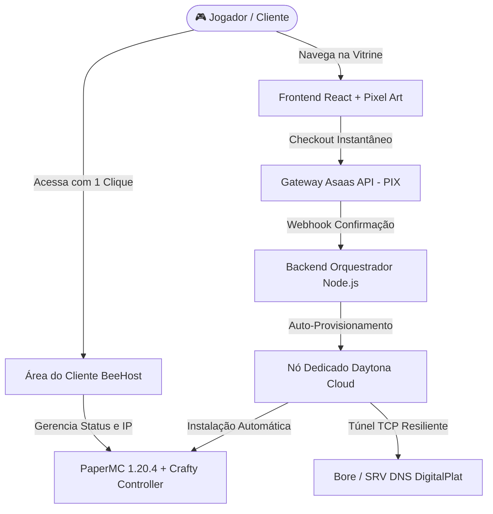

<div align="center">

# 🐝 BeeHost — Cloud Gaming Infrastructure Platform

**Plataforma Full-Stack de Orquestração, Venda e Gerenciamento de Servidores de Jogos**

[](https://react.dev/)
[](https://www.typescriptlang.org/)
[](https://tailwindcss.com/)
[](https://nodejs.org/)
[](https://vitejs.dev/)
[](https://nodejs.org/api/test.html)

<p align="center">
  Uma solução completa de ponta a ponta projetada para democratizar a hospedagem de servidores de jogos multiplayer (Minecraft PaperMC), integrando vitrine de vendas pixel art, gateway de pagamentos PIX instantâneo, auto-provisionamento em nuvem isolada e portal de autoatendimento para clientes.
</p>

</div>

---

## 🌟 Visão Geral da Arquitetura

A **BeeHost** resolve o atrito tradicional de compra e configuração de servidores de jogos através de uma esteira automatizada dividida em 5 camadas:



---

## 🚀 Principais Módulos do Sistema

### 1. 🎨 Vitrine Comercial & Experiência Gamer (Storefront)
* **Design System Retro Pixel Art:** Identidade visual inspirada em clássicos dos games, tipografia Google Fonts (*Pixelify Sans* e *Plus Jakarta Sans*) e paleta curada em tons de azul-marinho e amarelo mel.
* **Sintetizador de Áudio 8-Bit Nativo:** Módulo Web Audio API puro que sintetiza efeitos sonoros retrô ao navegar, clicar e concluir pedidos sem carregar arquivos pesados de MP3.
* **Internacionalização Robusta (i18n):** Suporte nativo e instantâneo a Português (PT-BR) e Inglês (EN-US), com preservação de preferências e suite de **15 testes unitários automatizados** com 100% de cobertura de textos.

### 2. 💳 Motor de Cobrança PIX Automático (Fintech Integration)
* **Integração com Asaas API v3:** Emissão de cobranças dinâmicas com QR Code e código *Pix Copia e Cola*.
* **Reconhecimento Instantâneo via Webhook:** Recebimento do evento `PAYMENT_RECEIVED` com atualização em tempo real no frontend e emissão imediata das credenciais do servidor.
* **Modo de Simulação Inteligente (Mock Sandbox):** Capacidade de operar e demonstrar o fluxo de ponta a ponta em ambientes de desenvolvimento sem depender de chaves de produção.

### 3. ☁️ Orquestração de Nós & Infraestrutura Dedicada
* **Isolamento Total por Instância (Single-Tenant Sandboxes):** Cada cliente opera em um container dedicado com recursos garantidos de CPU e RAM, eliminando problemas de *noisy neighbors*.
* **Otimização de Performance:** Bootstrap automático de PaperMC 1.20.4 com Java 21 LTS e **Aikar's Flags** para coletor de lixo de baixa latência (G1GC).
* **Tunelamento TCP e Resolução de Domínio:** Conexão pública estável contornando restrições de rede através de túneis TCP dedicados e registros DNS SRV (`jogar.beehost.qd.je`).
* **Migração Dinâmica de Nós (Node Balancing):** Script de sincronização direta máquina-a-máquina via `rsync` em menos de 30 segundos, permitindo balanceamento contínuo de custos sem necessidade de storage externo caro.

### 4. 👤 Portal do Cliente (Client Hub & Self-Service)
* **Autenticação Direta:** Modal retrô acessível no cabeçalho da vitrine com controle de sessão.
* **Monitoramento em Tempo Real:** Exibição do status (`Online`, `Offline`, `Reiniciando`), endereço de conexão com botão de cópia rápida e métricas de hardware.
* **Ações Rápidas de Energia:** Botões de Iniciar, Reiniciar e Parar o servidor sem precisar de terminal.
* **Acesso ao Console Avançado:** Atalho integrado para o painel web administrativo do servidor (Crafty Controller na porta `8443`).

### 5. 📊 Painel Administrativo do Operador (Admin Dashboard)
* Dashboard central para monitoramento da saúde das instâncias, esteira de rotação de chaves e histórico de provisionamentos.

---

## 📂 Estrutura do Repositório

```text
├── backend/
│   ├── dados/              # Persistência local (contas, clientes, pedidos)
│   ├── notificacoes/       # Disparadores de alertas (WhatsApp / Evolution API)
│   ├── pagamentos/         # Módulo cliente da API Asaas (PIX & Webhooks)
│   ├── gerenciador-fila.js # Algoritmo de esteira e balanceamento de nós
│   └── server.js           # API REST HTTP nativa de alta performance
│
├── docs/                   # Manuais técnicos, arquitetura e playbooks de operação
│   ├── 00-ROTEIRO-MESTRE.md
│   ├── 01-ARQUITETURA-E-REGRAS.md
│   ├── 04.5-PASSO-C.5-PAINEL-DO-CLIENTE-E-LOGIN.md
│   └── ...
│
├── scripts/                # Scripts shell de automação e orquestração
│   ├── daytona-minecraft.sh # Bootstrap automático de Java 21 + PaperMC
│   ├── instalar-crafty.sh   # Instalação do painel web Crafty Controller
│   ├── iniciar-tunel.sh     # Inicializador de túnel TCP resiliente
│   └── executar-swap.sh     # Migração rápida máquina a máquina via rsync
│
├── src/                    # Frontend React + TypeScript + Tailwind
│   ├── components/         # Componentes modulares, UI, Audio e Checkout
│   ├── pages/              # Páginas SPA / MPA da aplicação
│   ├── i18n/               # Motor de internacionalização (PT/EN)
│   └── data/               # Catálogo de planos e especificações
│
├── tests/                  # Testes automatizados (Node Test Runner)
├── .env.example            # Modelo documentado de variáveis de ambiente
└── vite.config.ts          # Configuração de build multi-page otimizada
```

---

## 🛠️ Tecnologias Utilizadas

* **Frontend:** React 19, TypeScript, TailwindCSS v4, Lucide Icons, Canvas Confetti.
* **Efeitos & UX:** Web Audio API (Sintetizador 8-bit nativo).
* **Backend:** Node.js 22 LTS (Native HTTP Server sem dependências pesadas).
* **Infraestrutura & Nuvem:** Daytona Cloud, PaperMC, Crafty Controller, Rsync, Tmux.
* **Gateways & APIs:** Asaas API v3 (PIX), Evolution API (WhatsApp).
* **Qualidade:** Oxlint (Linter ultrarrápido) e Node.js Test Runner nativo.

---

## 💻 Como Executar Localmente

### 1. Clonar e Instalar Dependências
```bash
git clone https://github.com/ryuclover/BeeHost.git
cd BeeHost
npm install
```

### 2. Configurar Variáveis de Ambiente
Copie o arquivo de exemplo:
```bash
cp .env.example .env
```
*(As credenciais já contam com modo de demonstração automática habilitado para testes locais imediatos).*

### 3. Executar o Backend e a Vitrine
Em terminais separados:
```bash
# Terminal 1: Iniciar API e Painel Admin (Porta 3001)
npm run backend

# Terminal 2: Iniciar Vitrine Frontend (Porta 5173)
npm run dev
```

### 4. Rodar Testes Automatizados e Build
```bash
npm test        # Executa os 15 testes de regressão e internacionalização
npm run build   # Valida a tipagem TypeScript e gera o bundle de produção
```

---

## 🏆 Demonstração do Fluxo de Autoatendimento

1. Acesse `http://localhost:5173` e explore o catálogo.
2. Na aba de planos, clique em **Pagar com PIX e Ativar** para abrir o modal de checkout instantâneo.
3. Clique em **⚡ Simular Pagamento Aprovado** para visualizar a animação de sucesso e criação imediata da instância.
4. Clique em **Log In** no topo do site e use as credenciais de teste (`demo@beehost.com` / `senha: 123`) para gerenciar o servidor no **Painel do Cliente**.

---

## 📄 Licença & Autoria

Desenvolvido por **Gabriel (ryuclover)** como projeto de portfólio demonstrando competências avançadas em:
- Arquitetura de Software Full-Stack
- Integração de Sistemas de Pagamento (PIX)
- Orquestração e Automação de Infraestrutura em Nuvem
- Design de Interfaces e Experiência do Usuário (UI/UX)
